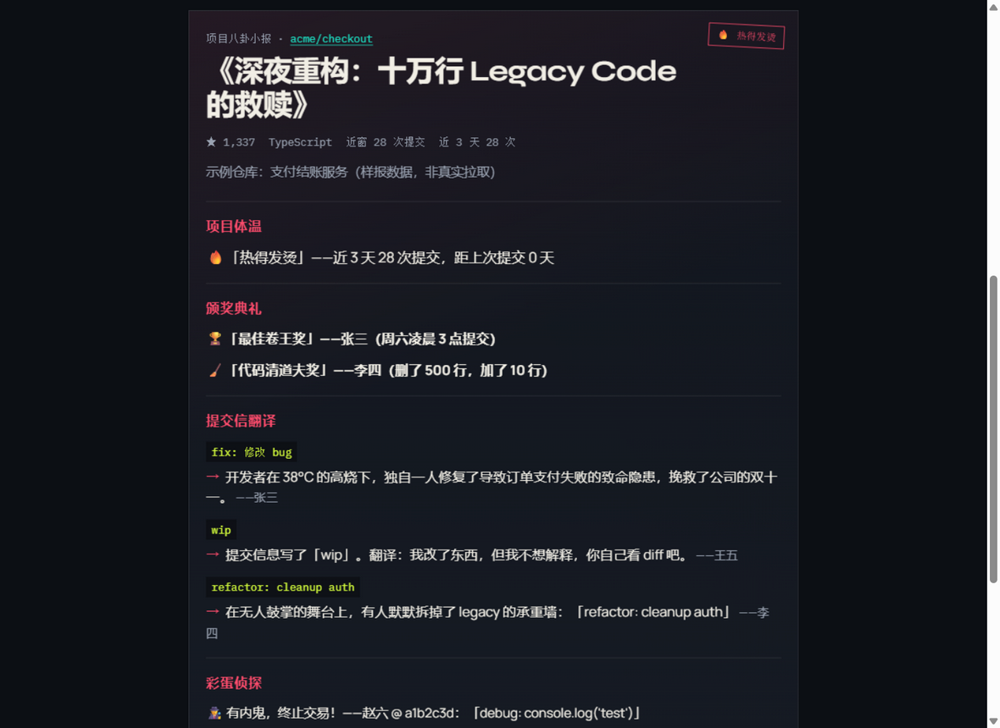
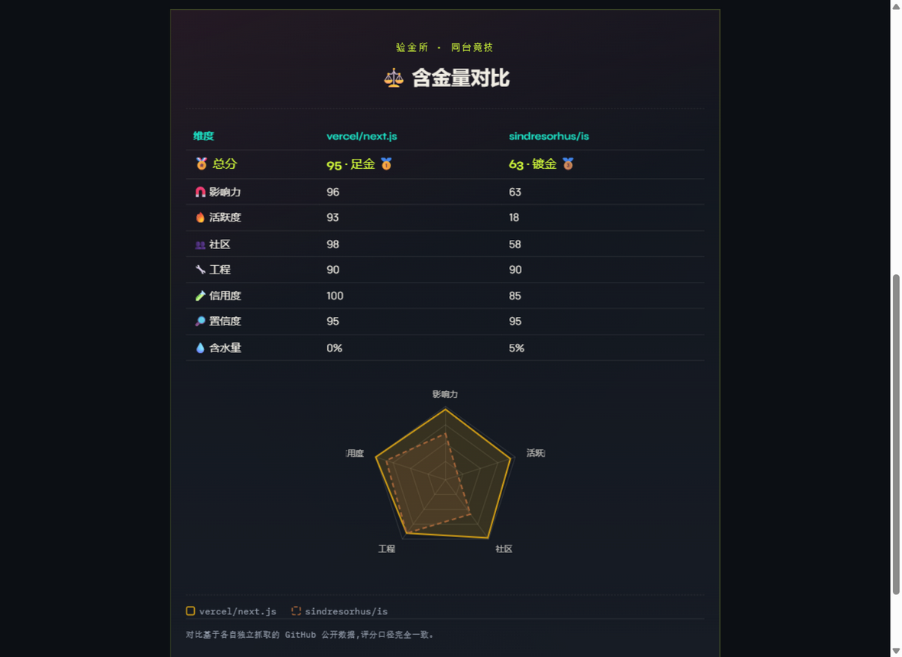
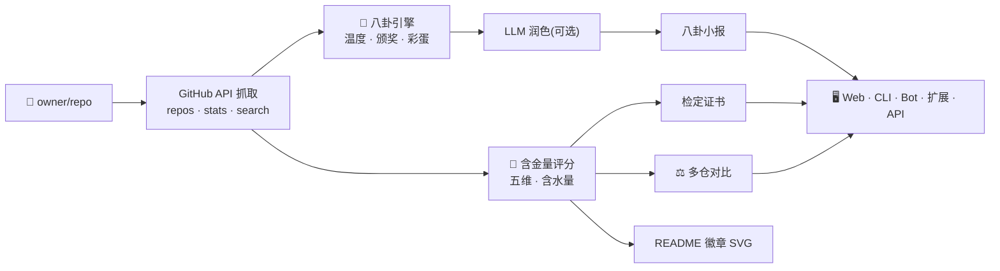

<div align="center">
  

  <p>
    <a href="LICENSE"></a>
    <a href="package.json"></a>
    <a href="package.json"></a>
    <a href=".github/workflows/ci.yml"></a>
  </p>

  **把 GitHub 仓库链接丢进去 —— 拿走一份「项目八卦小报」,或一份可解释的「含金量检定报告」。**

  [快速上手](#-30-秒上手) · [截图预览](#-一眼真) · [评分模型](#-含金量评分模型) · [架构](#%EF%B8%8F-架构) · [部署](#-部署)
</div>

---

## ✨ 两大模式

| | 📰 出报 · 八卦小报 | 🧪 验金 · 含金量检定 |
|---|---|---|
| **回答的问题** | 这个仓库最近发生了什么趣事? | 这个仓库值不值得信? |
| **产出** | 影评式标题、趣味颁奖典礼、提交信翻译、彩蛋侦探 | 0-100 总分、五维评分、置信度、含水量估计、逐项证据 |
| **数据源** | 近窗 commits + PR / Issue / Release | 全年 commit 活跃度、贡献者分布、Search 计数、star 时间线 |
| **LLM** | 可选润色(离线模板兜底) | 不调用 —— 模板直出,防幻觉数字 |

Web 预览站顶部一键切换;CLI 用 `--score` / `--compare`;同一引擎,两种口吻。

## 📸 一眼真

<div align="center">

**🧪 含金量检定证书**(vercel/next.js 实测)


<br/><br/>

**📰 八卦小报**(样报) · **⚖️ 多仓对比**(双仓库 + 雷达)

 

</div>

## 🧪 含金量评分模型

五维等权合成,每个子信号可解释、可追溯 —— 指标定义参考 [CHAOSS](https://chaoss.community/)(Bus Factor)、[OpenSSF Scorecard](https://openssf.org/)(工程清单)与 npms / libraries.io 的加权结构。

| 维度 | 看什么 | 关键信号 |
|---|---|---|
| 🧲 **影响力** | 有多少人真的在用 | star(对数刻度)· fork/star 健康区间 · watcher |
| 🔥 **活跃度** | 还活着吗 | 周均 commit · 近 4 周/前 8 周动能 · 90 天合并 PR · 发版节奏 |
| 👥 **社区** | 走了一个撑得住吗 | 贡献者规模 · **Bus Factor**(覆盖 50% 贡献所需人数)· issue 关闭吞吐 |
| 🔧 **工程** | 靠谱吗 | license · README · CI · CONTRIBUTING · SECURITY · 30 天内推送 |
| 🧪 **信用度** | star 是真金还是镀的 | 比例健全性检查 · **含水量检测**(star 时间线突发 + 比例异常) |

**等级**:≥85 足金 🥇 · 70-84 K金 🥈 · 55-69 镀金 🥉 · 40-54 掺水 ⚠️ · <40 贴纸 🧻

> **反刷星**:研究显示 GitHub 上存在约 [600 万疑似假 star](https://arxiv.org/html/2412.13459v2)。验金所会检测「单日尖峰 / 连续堆量」的疑似刷量窗口与「高星低互动」比例异常,给出含水量估计 —— 只报告统计模式,不指控任何账号。
>
> **置信度**:数据不足(如未配 token、stats 端点降级)时自动降权并标注「缺失信号」,不假装确定。
>
> **已知限制**:star 时间线(stargazers)受 GitHub 访问策略约束 —— 个别账号/网络环境会被定向限制(REST 404)。此时含水量自动退化为比例信号并在缺失信号中标注 `star 时间线(stargazers)`;其余维度不受影响。

## 🚀 30 秒上手

```bash
git clone https://github.com/LinJJ12/repo-gossip.git
cd repo-gossip
cp .env.example .env   # 按需填 GITHUB_TOKEN / LLM_*
npm install
npm run web
```

打开 [http://localhost:5173](http://localhost:5173),粘贴 `owner/repo` 或 GitHub URL → **出报**;点 **验金** 或填多个仓库(逗号分隔)→ **检定 / 对比**。

只要终端也行:

```bash
npm run gossip -- vercel/next.js --offline          # 📰 八卦小报(离线)
npm run gossip -- vercel/next.js --score            # 🧪 含金量检定
npm run gossip -- vercel/next.js sindresorhus/is --compare   # ⚖️ 双仓对比(--lang en 切英文)
```

## 🧭 入口一览

| 入口 | 适合 | 命令 / 路径 |
|------|------|-------------|
| **Web** | 本地预览、给同事试用 | `npm run web` |
| **CLI** | 脚本 / 终端 | `npm run gossip -- owner/repo` |
| **Chrome 扩展** | 日常刷 GitHub | [`apps/extension`](apps/extension/README.md) |
| **Bot** | 群里随手问 | `npm run bot` |
| **HTTP API** | 自建集成 | `POST /api/gossip` |
| **README 徽章** | 项目的实时含金量 | `GET /api/badge/:owner/:repo.svg` |

## 💡 使用说明

### Web 预览站

```bash
npm run web          # http://localhost:5173
npm run web:build    # 生产构建
```

- 顶部「📰 出报 / 🧪 验金」切换;验金模式下填 2-4 个仓库(逗号分隔)自动进入对比视图
- 可调回溯天数、是否调用 LLM
- 请求走同源 `/api/gossip`(开发时由 Vite 中间件提供)
- 出报成功后可点 **「最近」**,在本机回看缓存小报(`localStorage`,最多 20 条;与扩展不同步)

### CLI

```bash
npm run gossip -- owner/repo                       # 八卦小报
npm run gossip -- https://github.com/owner/repo --days 14
npm run gossip -- owner/repo --offline             # 不调 LLM
npm run gossip -- owner/repo --score               # 含金量检定
npm run gossip -- owner/a owner/b --compare        # 2-4 个仓库对比(--lang en 切英文)
```

### Chrome 扩展

开源 MV3,**不上架应用商店**——用「加载已解压的扩展程序」安装。

完整步骤 → **[apps/extension/README.md](apps/extension/README.md)**

摘要:

1. 先有可访问的 API(本地 `npm run web`,或你的 Vercel 域名)
2. `chrome://extensions` → 开发者模式 → 加载 `apps/extension`
3. 工具栏弹层粘贴仓库出报;GitHub 仓库页有可拖动的「八卦小报」按钮
4. **「最近」** 在弹层 / 完整页 / 侧边栏共用同一份本机历史(`chrome.storage.local`)

### 即时通讯 Bot

<details>
<summary><strong>Telegram</strong></summary>

1. [@BotFather](https://t.me/BotFather) 创建 Bot,取得 `TELEGRAM_BOT_TOKEN`
2. 本地轮询:`TELEGRAM_BOT_TOKEN=xxx npm run bot`
3. 或 Webhook:`https://<域名>/api/telegram`(建议同时设 `TELEGRAM_WEBHOOK_SECRET`)

命令:`/gossip owner/repo` · `/score owner/repo` · `/compare owner/a owner/b`,或直接发 GitHub 链接。

</details>

<details>
<summary><strong>Discord</strong></summary>

```bash
DISCORD_BOT_TOKEN=xxx npm run bot
```

斜杠命令:`/gossip repo:owner/repo` · `/score repo:owner/repo` · `/compare repos:"owner/a owner/b"`

> `/api/discord` Interactions Webhook 仍为 **501**。请用常驻 Bot,不要配置 Interactions Endpoint。

</details>

<details>
<summary><strong>飞书</strong></summary>

- 事件订阅:`https://<域名>/api/feishu`
- 配置:`FEISHU_APP_ID` / `FEISHU_APP_SECRET` / `FEISHU_VERIFICATION_TOKEN`
- 命令:发 `score <仓库>`(验金)、`compare <仓库1> <仓库2>`(对比),或直接发仓库链接出小报

</details>

### HTTP API

```bash
curl -X POST https://<domain>/api/gossip \
  -H "content-type: application/json" \
  -d '{"repo":"vercel/next.js","format":"web","offline":true}'
```

| 字段 | 说明 |
|------|------|
| `repo` | `owner/repo` 或 GitHub URL |
| `format` | `web`(默认)· `markdown` · `json` · `discord` · `feishu` |
| `days` | 1–90 |
| `offline` | `true` 时不调 LLM |
| `mode` | `score` → 评分卡 `{kind:"score", score, message, missing}`;`compare` → 对比 `{kind:"compare", entries, message}` |
| `repos` | `mode:"compare"` 的仓库数组(2–4 个) |
| `lang` | `en` 切换评分/对比文案为英文(默认 `zh`) |

可选 **BYOK** 请求头(优先于服务端环境变量,不落日志 / 响应体):

| Header | 映射 |
|--------|------|
| `x-github-token` | `GITHUB_TOKEN` |
| `x-llm-api-key` | `LLM_API_KEY` |
| `x-llm-base-url` | `LLM_BASE_URL` |
| `x-llm-model` | `LLM_MODEL` |

内部调用可带 `Authorization: Bearer $WEBHOOK_SECRET` 或 `x-webhook-secret`。公开路径有进程内限流与短时缓存。

**README 徽章**:把下面这行放进任意项目 README,实时展示其含金量(失败/限流均输出灰色 N/A,永不破图;`?lang=en` 英文;服务端对单 IP 独立限流,防止枚举烧穿 GitHub 配额):

```md

```

## ⚙️ 环境变量

复制 [`.env.example`](.env.example) → `.env`。常用项:

| 变量 | 说明 |
|------|------|
| `GITHUB_TOKEN` | 提高限额 / 读私有仓;评分的 Search 计数与 star 时间线建议必配 |
| `LLM_API_KEY` · `LLM_BASE_URL` · `LLM_MODEL` | 兼容 OpenAI Chat Completions |
| `LLM_TIMEOUT_MS` | 单次 LLM 请求超时(毫秒,默认 20000),超时回落本地模板 |
| `GOSSIP_MAX_COMMIT_DETAILS` | 单次出报拉取提交详情的 commit 上限(默认 20,设 0 退化为纯列表出报) |
| `GOSSIP_OFFLINE` | `1` 强制本地模板 |
| `WEBHOOK_SECRET` | 内部调用校验(可选) |
| `GOSSIP_REQUIRE_WEBHOOK_SECRET` | `1` 时生产强制鉴权 |
| `GOSSIP_CORS_ORIGINS` | CORS,逗号分隔或 `*` |
| `GOSSIP_RATE_LIMIT_*` · `GOSSIP_CACHE_TTL_SEC` | 限流与缓存(`GOSSIP_RATE_LIMIT_IP_PER_HOUR` / `_REPO_PER_HOUR` / `_BADGE_PER_HOUR`,徽章端点独立限流) |
| `GOSSIP_BOT_USER_RATE_LIMIT` | Bot 每用户命令限速(每 10 分钟次数,默认 12,0 不限) |

Bot 相关变量见 `.env.example` 注释。

## 🏗️ 架构



```text
repo-gossip/
├── packages/core/     # 引擎:github · github-score · score · watermark · compare · analyzer · llm · format · http-api · CLI
├── apps/
│   ├── web/           # Vite + React 预览站(出报 / 验金 / 对比,含本机「最近」)
│   ├── bot/           # Discord / Telegram / 飞书(gossip · score · compare)
│   └── extension/     # Chrome MV3(sideload)
├── api/               # Vercel Serverless(gossip · badge —— 仅协议转换,业务在 core)
├── test/              # 单测(197 例)
├── docs/              # 架构说明与图片资产
└── package.json
```

更多:[docs/architecture.md](docs/architecture.md)

## 🛠️ 开发

| 命令 | 作用 |
|------|------|
| `npm run gossip -- …` | CLI 出报 / 验金 / 对比 |
| `npm run web` | 预览站 |
| `npm run bot` | 长连接 Bot |
| `npm test` | 单测 |
| `npm run typecheck` | 类型检查(core / bot / web / api) |

CI:Push / PR 跑 `npm test` 与 `npm run typecheck`([`.github/workflows/ci.yml`](.github/workflows/ci.yml))。

## 🚢 部署

| 入口 | 怎么做 |
|------|--------|
| **Vercel**(Web + API) | 根目录 `npx vercel`;静态来自 `apps/web`,`/api/*` 为 Serverless |
| **Chrome 扩展** | 加载 `apps/extension`;API Base URL 指向你的后端 |
| **常驻 Bot** | `npm run bot`(Railway 等) |

建议在宿主环境配置 `GITHUB_TOKEN`、`LLM_API_KEY`(或依赖 BYOK)。纯演示可设 `GOSSIP_OFFLINE=1`。

## 🔒 安全

完整说明见 [SECURITY.md](SECURITY.md)。要点:

- 不要把 `WEBHOOK_SECRET`、LLM Key、GitHub Token、扩展打包私钥(`*.pem`)写进源码或提交进 Git
- 扩展 BYOK 只存在本机;请求只发往你配置的 API Base URL
- 公开 `/api/gossip` 默认可不带 Webhook 密钥;生产若要强制鉴权,设 `GOSSIP_REQUIRE_WEBHOOK_SECRET=1`
- Web「最近」与扩展「最近」互不同步(浏览器存储隔离)
- 发现漏洞请走私密渠道报告,不要开公开 Issue 贴密钥

## License

[MIT](LICENSE)

## 致谢

感谢 [LINUX DO](https://linux.do) 社区的推广支持,以及佬友们的反馈。

评分模型参考:[CHAOSS](https://chaoss.community/) 指标体系 · [OpenSSF Scorecard](https://github.com/ossf/scorecard) · [StarScout 假 star 研究](https://arxiv.org/html/2412.13459v2) · [OSSInsight](https://ossinsight.io/) / [OpenDigger](https://open-digger.cn/) 的量化思路。
